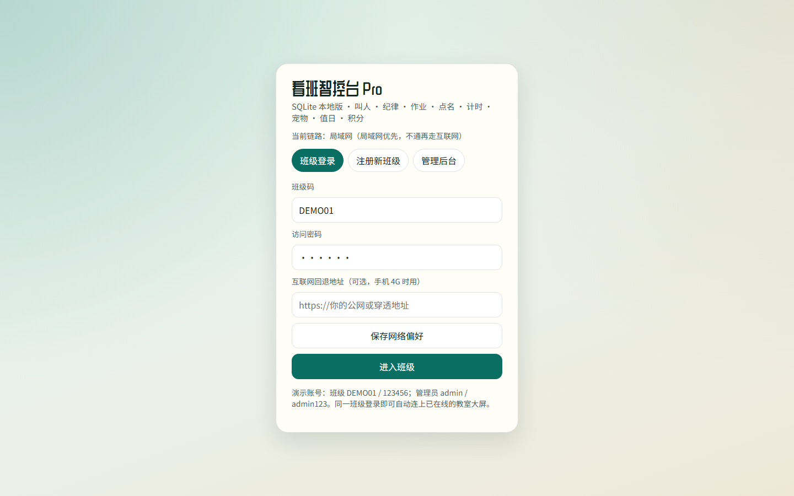
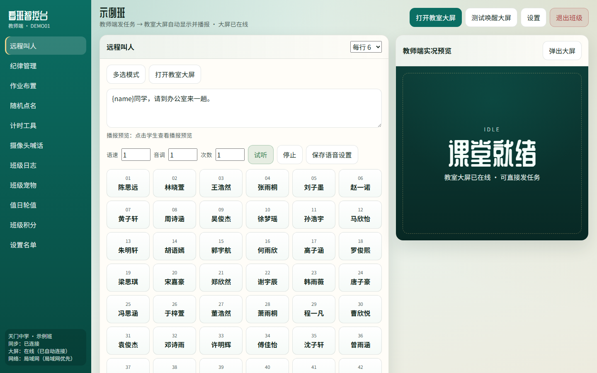
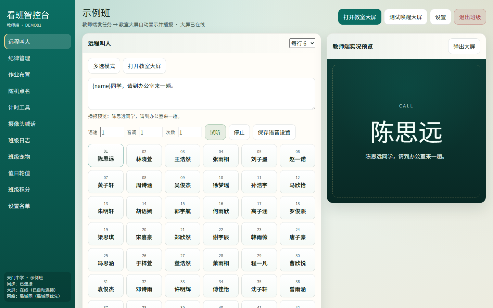
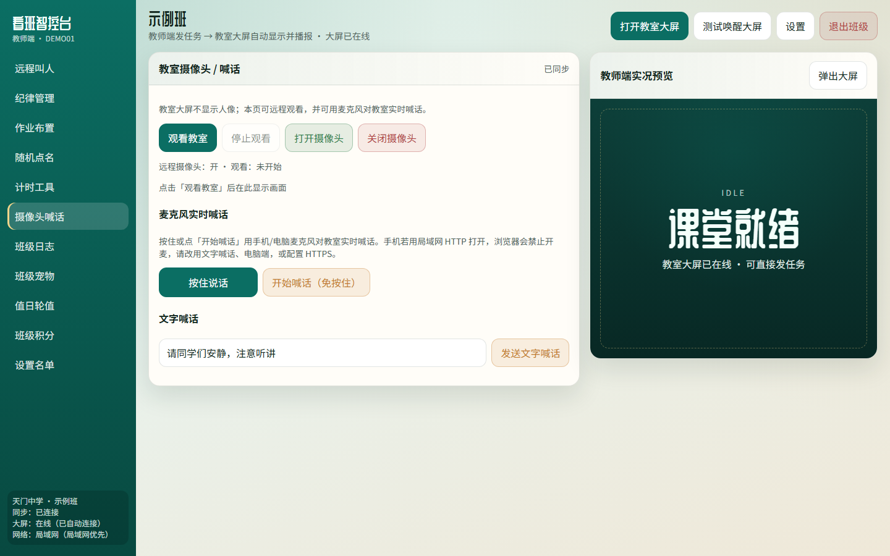
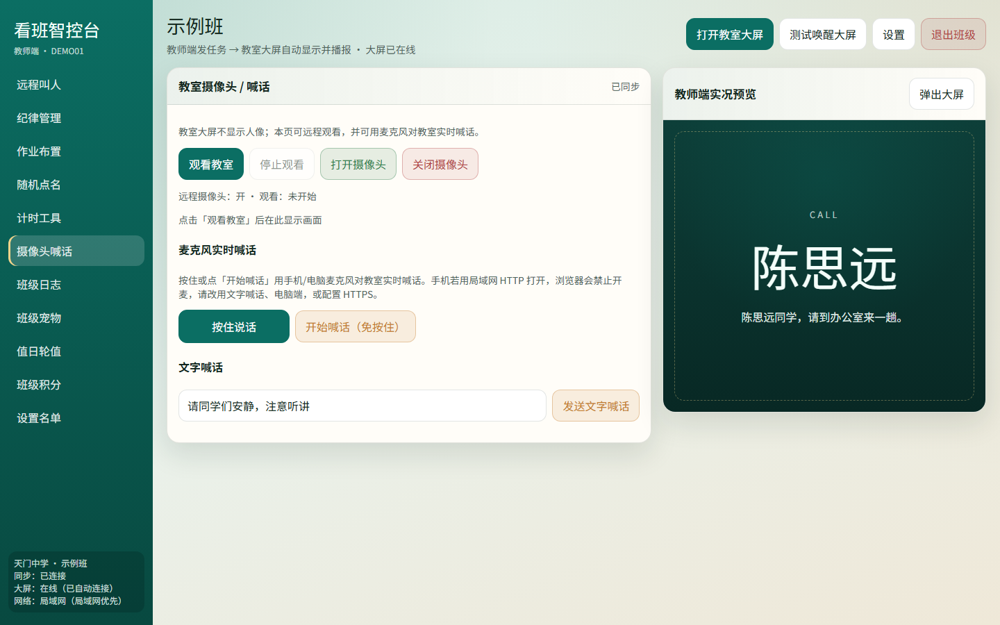
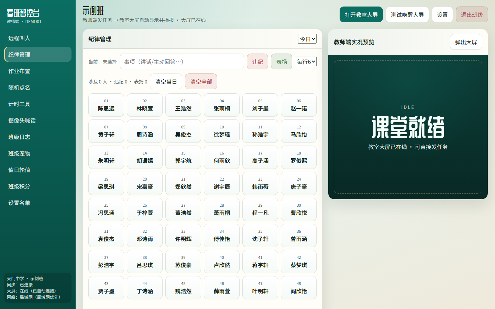
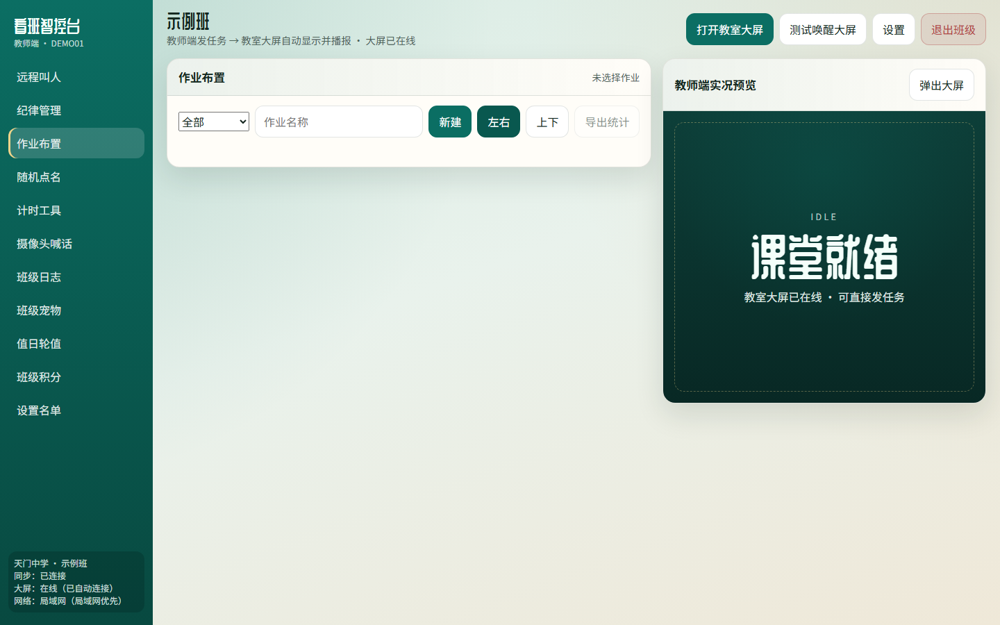
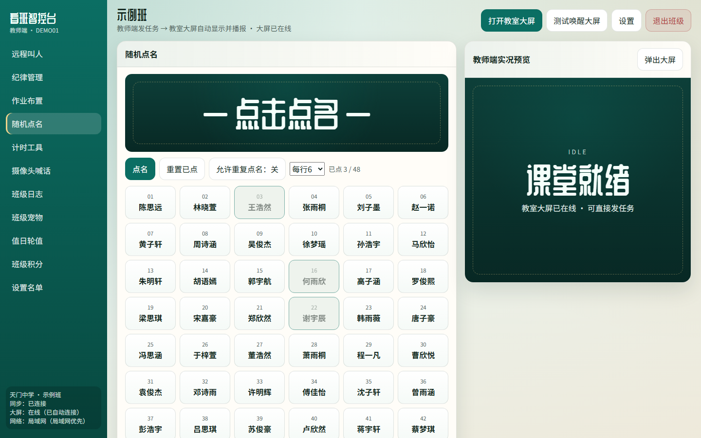

# 用WORKBUDDY遥控教室：远程叫人一喊就到，摄像头喊话不用跑腿

上一篇讲了提示词怎么喂给 WORKBUDDY，这套「看班智控台 Pro」是怎么陪写出来的。

这篇不聊代码。只聊班主任打开浏览器之后，两分钟内最该点哪里。

重点就两个字：**叫人**，再加三个字：**喊得见**。

> [!important] 先打开再对照
> http://test.zjjdg.top:5666
> 班级码 `DEMO01`，密码 `123456`
> 建议手机开教师端，电脑再开一个「教室大屏」窗口对照

## 登录进来，先看三处状态

:::gallery[登录与工作台]

:::

*左下角会显示同步状态、大屏是否在线、当前走局域网还是互联网。*

登录后左侧是竖栏。远程叫人、纪律、作业、点名、计时、摄像头喊话……一眼排开。

右侧有一块「教师端实况预览」。它不是装饰，是教室一体机此刻该显示的内容。大屏在线时，这里写着「可直接发任务」。

顶栏有「打开教室大屏」。一体机用这个；教师端继续留在手机或笔记本上。

## 远程叫人：模板改好，点名就走

侧栏点「远程叫人」。

*播报模板、语速音调、学生网格，全在一页。*

默认模板是：

`{name}同学，请到办公室来一趟。`

`{name}` 会自动替换成学生姓名。你也可以改成：

- `{name}同学，请带上练习册到办公室`
- `{name}，第二节课后来找我一下`

改完可试听，再保存语音设置。语速、音调、重复次数按教室音箱调，嘈杂的教室建议次数设成 2。

单人呼叫：直接点学生卡片。  
多人呼叫：开「多选模式」，勾几个人，点「立即呼叫」。

*点下去之后，右侧实况会切到姓名 + 事项。教室端同步播报。*

我自己用下来，最爽的是「人在别的楼，班里不用派通讯员」。办公室找三个学生，手机点三下，走廊安静多了。

## 摄像头喊话：先看见，再开口

侧栏点「摄像头喊话」。

*观看、开摄像头、按住说话、文字喊话，四件事分得清楚。*

用法建议按这个顺序：

1. 确认教室大屏已登录、侧栏显示「大屏：在线」
2. 点「打开摄像头」或直接「观看教室」
3. 画面只在教师端出现，教室大屏故意不跟人像，减少学生紧张感
4. 需要立刻制止时：按住「按住说话」，对着手机讲；或者输入文字，点「发送文字喊话」

文字喊话适合短指令：「请同学们安静，注意听讲。」  
麦克风适合临时叮嘱、叫停起哄、提醒值日生关门窗。

浏览器第一次会要麦克风权限。局域网用 `http` 时，有的手机浏览器会拦麦克风，换成同一 WiFi 下的推荐地址，或按页面提示操作即可。

*远程课堂管理里，这一页决定你「在不在场」的体感。*

## 其他功能怎么搭着叫人用

纪律：叫完人回来，顺手记一条违纪或表扬，今日榜自动更新。  
作业：自习课布置，左右栏拨完成状态，完成率挂在上面。  
随机点名：提问用，滚动停在谁就是谁，可排除已点过的。  
计时：限时小练，到点教室播「时间到」。

:::gallery[纪律·作业·点名]

:::

*这些模块不抢戏，但和叫人、喊话拼在一起，才是完整的远程课堂管理。*

名单不对？进「设置名单」导入 Excel/CSV。演示数据可以先玩，真用时换成自己班。

## 一套最小操作清单（建议收藏）

1. 教室一体机打开测试站，登录同一班级，进大屏  
2. 手机登录教师端，看侧栏「大屏：在线」  
3. 「远程叫人」点两名学生，听播报  
4. 「摄像头喊话」看一眼教室，发一句文字喊话  
5. 需要时再开纪律 / 作业 / 计时

整套流程跑通，大概五分钟。

> [!tip] 再放一次入口
> http://test.zjjdg.top:5666
> `DEMO01` / `123456`
> WORKBUDDY 陪写的看班智控台 Pro

远程课堂管理这件事，说白了就两句：

**名字要叫得到人，声音要传得进教室。**

叫人模块解决第一句，摄像头喊话解决第二句。其余功能是日常缝补。

你如果也是两头跑的班主任，先别谈理念。打开链接，点两个名字，喊一句「安静」。体感对了，再谈要不要部署到自己学校。

以上。有用就赞、在看、转发三连。要持续收到推送，星标一下。

谢谢你看我的文章，我们下次再见。
