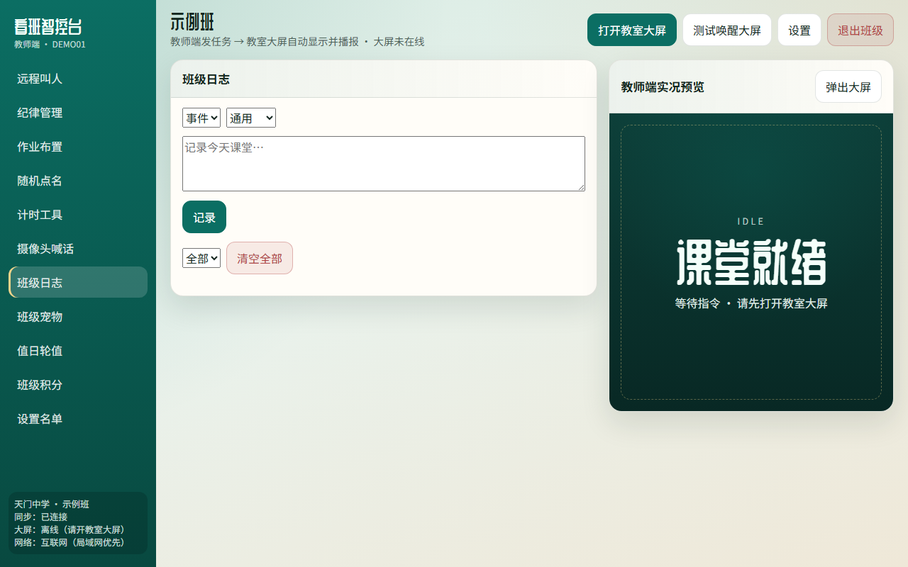
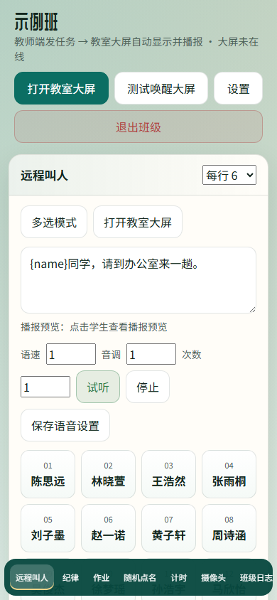

# 用WORKBUDDY手搓看班系统：一套通用提示词，我把教室大屏做成了智控台

先说结论：这不是又一篇“AI 写了个 Demo”的吹嘘文。

我拿 WorkBuddy（同类 AI 编程助手也一样），用**一套可复用的提示词**，把一个真正能进教室用的系统搓出来了——教师端发指令，教室大屏自动显示、播报。名字叫**看班智控台 Pro**。

测试地址（示例班可直接试）：

http://test.zjjdg.top:5666/

演示班级：`DEMO01` / `123456`


很多人问我：用大模型做系统，提示词到底怎么写？我把这套流程摊开讲——从第一句到最后一版，怎么迭代，通用模板你直接抄。

---

## 一、我真正在搓的是什么

目标很具体：办公室里用手机/电脑点一下，教室大屏立刻喊人、贴纪律、推作业、随机点名……大屏那边最好常驻，教师端随时连上。

技术上我没硬上复杂云原生，就是：

- 教师端 + 教室大屏（同一班级账号，WebSocket 同步）
- 后端 Express + SQLite（方便往群晖这类机器上扔）
- 前端 React，局域网优先，互联网兜底

登录进去大概是这样：


左侧一排功能，右侧有个“教师端实况预览”，中间是当前模块。看板离线时会提醒你先开教室大屏——这点很重要，很多“远程看班”工具翻车就翻在两端没连上。

---

## 二、通用提示词模板（可直接改着复用）

下面这套，我后来做别的小工具也在用。核心就一句话：**先定产品边界，再定双端契约，再逼它给可运行切片，最后用真实场景打补丁。**

### 模板 A：立项（第一句就要写清楚）

```text
你是资深全栈工程师。请从零实现「教室双端管理系统」：

【产品】
- 教师端：手机/PC 浏览器，发指令
- 教室大屏端：常开网页或桌面壳，接收并展示/播报
- 同一班级账号登录即可同步，不依赖第三方 IM

【必须功能（第一期）】
1. 远程叫人（选人 + 自定义话术 + 大屏语音）
2. 纪律提示 / 作业推送
3. 随机点名、计时器
4. 班级日志
5. 摄像头远程查看 + 文字/语音喊话（可第二期）

【技术约束】
- Node 后端 + SQLite 持久化
- 前端 React + TypeScript
- WebSocket 实时同步
- 局域网优先，可配置公网地址回退
- 部署要能塞进群晖/普通 Linux，少原生依赖

【交付方式】
- 先给目录结构与可运行最小闭环（登录→进班→发一条叫人→大屏显示）
- 每完成一块，列出下一步 3 个最值得做的增量
- 不要写空壳 UI；按钮要接到真实状态
```

这一段的价值不在“功能清单很长”，而在**双端模型**和**可运行闭环**。大模型最爱先画一堆好看页面，你不卡住“最小闭环”，后面全是废料。

### 模板 B：迭代补丁（每一轮都用）

```text
基于当前代码继续，不要重写整个项目。

【本轮只做】
- （写 1～3 个具体点，例如：叫人支持多人；名单禁止重复点名默认开）

【验收标准】
- 教师端操作后，大屏 2 秒内可见反馈
- 断线重连后状态可恢复
- 手机端可操作（别用 window.open 空页这类坑）

【禁止】
- 大改无关模块
- 引入重型云服务
- 用“伪实现 / TODO”交差

改完后：说明改了哪些文件、怎么本地验证。
```

我实际就是一轮一轮砸这个模板。叫人播报不完整？补队列。手机打不开大屏？改唤醒方式。群晖装不上 better-sqlite3？换成 sql.js。**提示词里写“基于当前代码继续、禁止重写”，比你口头求它“小心一点”管用一百倍。**

### 模板 C：功能说明书式增量（适合加模块）

```text
在现有侧边栏架构下新增模块「XXX」。

复用：班级会话、WebSocket 推送、大屏渲染管线、教师端预览。
UI：左侧入口 + 中间操作区 + 右侧预览同步。
数据：写入 SQLite，刷新可恢复。
大屏：给出展示文案/语音策略。
教师端：给出操作步骤与失败提示。

先改后端事件协议，再改前端，最后联调截图说明。
```

远程叫人、纪律、作业、点名、计时、摄像头喊话、宠物、值日、积分……基本都是按这个节奏长出来的。

---

## 三、我实际怎么迭代的（按时间线说人话）

**第 1 轮：先通“叫人”。**  
提示词只保一件事：点学生 → 大屏出字 + 说话。通了，才有后面一切。


**第 2 轮：把双端状态做诚实。**  
大屏离线就明说离线；同步已连接要看得见。别假装“已经发到教室了”。

**第 3 轮：补课堂刚需。**  
纪律、作业、随机点名、计时。这些不是花活，是老师每天会点的按钮。


**第 4 轮：摄像头 + 喊话。**  
WebRTC 远程看班、按住说话、文字喊话。这一块坑最多（HTTP 下麦克风、HTTPS、权限），提示词里要写清浏览器安全限制，不然模型会装作“已经能喊了”。


**第 5 轮：运营向功能。**  
班级日志、宠物、值日、积分，还有管理后台看各班使用情况。不是为了堆菜单，是为了让系统在班里“住得下去”。





教室大屏端自己长这样（常开即可）：


手机也能进教师端：




---

## 四、系统功能速览（这一篇只点到为止）

| 模块 | 干什么 |
|------|--------|
| 远程叫人 | 点名喊到办公室/楼道，可多人、可改话术与语速 |
| 纪律管理 | 一键推纪律提示到大屏 |
| 作业布置 | 作业上屏，学生抬头就看见 |
| 随机点名 | 课堂互动，可关“允许重复” |
| 计时工具 | 考试/限时任务 |
| 摄像头喊话 | 远程看班 + 语音/文字喊话 |
| 班级日志 | 留痕 |
| 班级宠物 | 轻量激励 |
| 值日轮值 | 值日安排 |
| 班级积分 | 积分与激励 |
| 设置名单 | 学生名单维护 |

下一篇我会把**远程叫人**和**摄像头喊话**拆细讲——这两块才是老师真正天天用的“远程手”。

---

## 五、给你抄作业的三句狠话

1. **先写双端契约，再写页面。** 教师发什么、大屏显什么、失败怎么提示，写进提示词。  
2. **每轮只改 1～3 点，验收标准写死。** 否则模型会“重构快乐”。  
3. **把真实部署环境写进约束。** 群晖、GLIBC、HTTP/HTTPS、手机浏览器——不写，它就当你永远在 localhost。

如果你也想用 WorkBuddy / Cursor / Claude Code 手搓校内部小工具，把上面三套模板改个产品名就能开干。

测试入口再放一次：http://test.zjjdg.top:5666/  
进班：`DEMO01` / `123456`

下一篇见：办公室里怎么把人喊到、把班看住。
