# 用WORKBUDDY手搓远程叫人+摄像头喊话：办公室里真能把班看住

上一篇讲了提示词怎么把「看班智控台 Pro」搓出来。这篇不谈方法论，只谈老师真正天天摸的两个按钮：**远程叫人**，以及**摄像头喊话**。

测试地址：http://test.zjjdg.top:5666/  
演示：`DEMO01` / `123456`

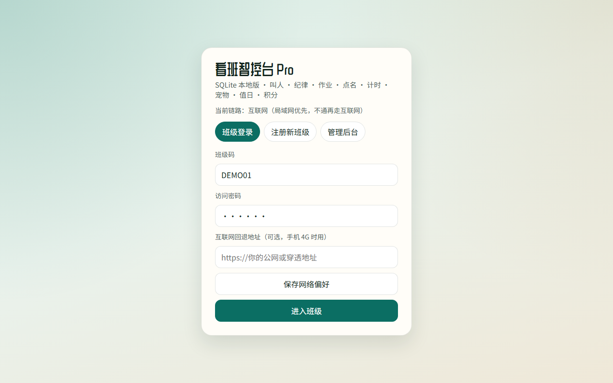

---

## 先搞清两端

这系统不是“教师端自嗨页面”。

- **教师端**：你在办公室、楼道、家里用手机或电脑登录班级。  
- **教室大屏**：教室电脑/一体机打开大屏页（或桌面壳），常挂着。

同一班级号进，WebSocket 一连上，你点的东西才会在大屏上炸开。侧栏底下能看见：同步是否连接、大屏在不在线、走的是局域网还是公网。

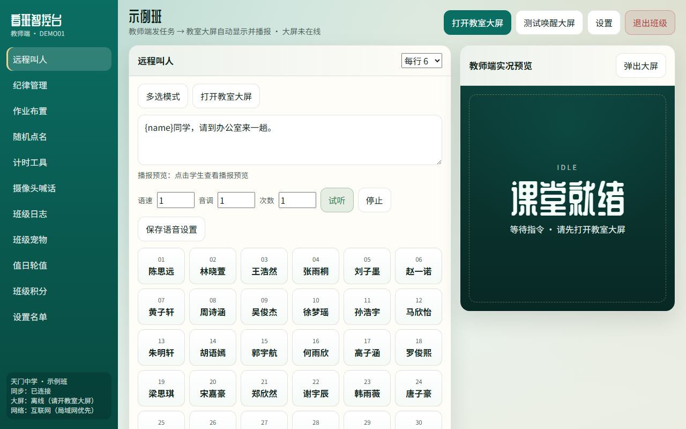

大屏离线时，预览区会老实写着 IDLE / 课堂就绪，并提示你去开教室大屏——别以为点了就一定传到教室，先看状态。

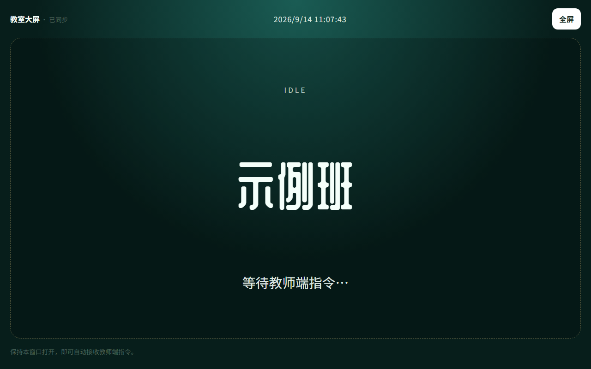

---

## 一、远程叫人：点名字，大屏替你喊

场景很土，但刚需：你在办公室改卷，班里某个学生要过来。以前靠班干部跑一趟，或者发消息指望有人看见。

现在：打开「远程叫人」，点学生卡片。

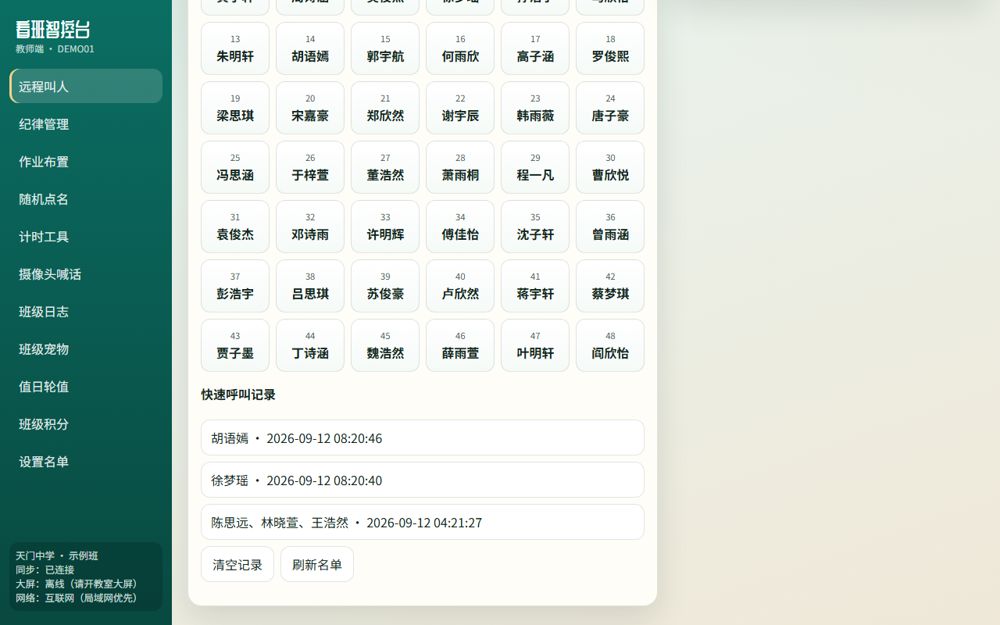

你可以：

- 单人点选，或多选模式一次喊一串人  
- 改话术模板，比如：`{name}同学，请到办公室来一趟。`  
- 调语速、音调、重复次数，先预览再保存  
- 看快速呼叫记录，谁被喊过一目了然

大屏侧会显示名字 + 播报。多人时先报名字再报事由，语音走队列，避免说到一半被下一条打断——这是真用过才知道要修的细节，不是产品简介上的形容词。

手机端同样能叫：

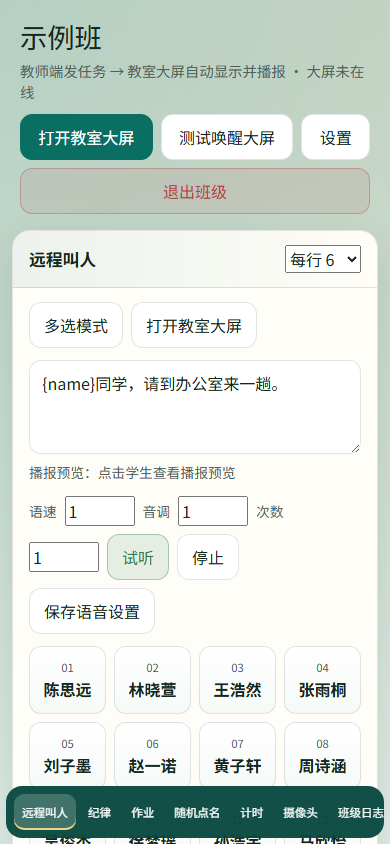

**使用小建议：**

1. 教室电脑先开大屏（或点教师端「打开教室大屏 / 测试唤醒大屏」）  
2. 确认侧栏「大屏」不是离线  
3. 再点人名；需要固定话术就先保存模板

叫人模块解决的是「把人请出来」；下一节解决的是「人还在班里时，你怎么看见、怎么喊住」。

---

## 二、摄像头喊话：远程看班 + 开口管一下

侧栏进「摄像头喊话」。

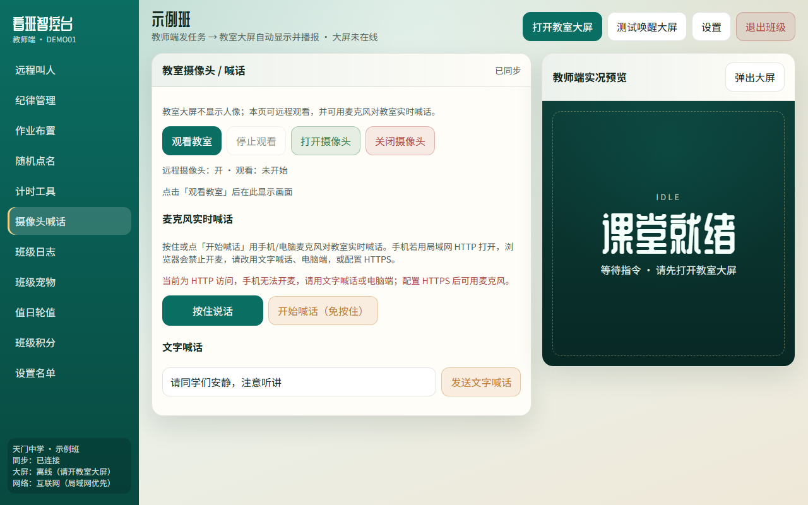

这块分三层，别混：

### 1）看教室

- **观看教室 / 停止观看**：教师端拉教室画面（大屏端摄像头默认给教师看，不在学生脸上怼预览窗）  
- **开启摄像头 / 关闭摄像头**：控制教室端采集

状态区会写：远程摄像头开没开、观看开没开。没开大屏时，这里再厉害也是空的——还是那句话，先连上教室。

### 2）实时麦克风喊话

- **按住说话**：按住说，松手停  
- **开始喊话（免提）**：适合说较长一段

浏览器安全策略很烦：很多手机在纯 HTTP 下没有麦克风权限。页面上会提示走 HTTPS 或本机可信环境。这不是系统矫情，是浏览器规矩。部署到公网时，尽量给证书。

### 3）文字喊话

输入一句「请安静，认真听讲」之类，点发送。大屏出字，适合你不方便说话、或只想冷冰冰提醒一下的时候。

**我自己用时的体感：**  
叫人是“点对点召回”；摄像头喊话是“远端值守”。午休、自习、你人在别的楼层时，看一眼有没有炸锅，比装十个监控 App 直接——至少班级维度、权限、和现有叫人/纪律是同一套登录。

---

## 三、其他功能（简写，知道有就行）

菜单上还有这些，上一篇提过，这里不展开：

- **纪律管理**：一键纪律上屏  
- **作业布置**：作业推到大屏  
- **随机点名**：课堂抽人（默认可关重复点名）  
- **计时工具**：限时任务  
- **班级日志**：操作留痕  
- **班级宠物 / 值日 / 积分**：轻激励与班务  
- **设置名单**：维护学生列表  

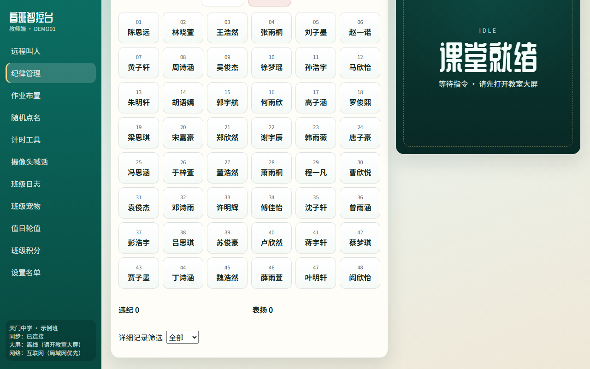

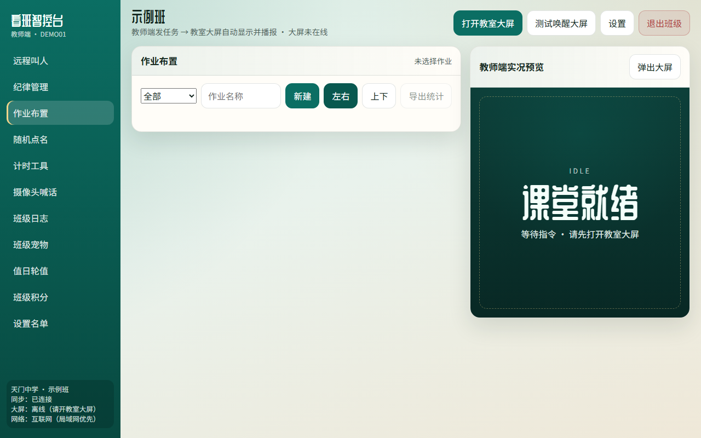

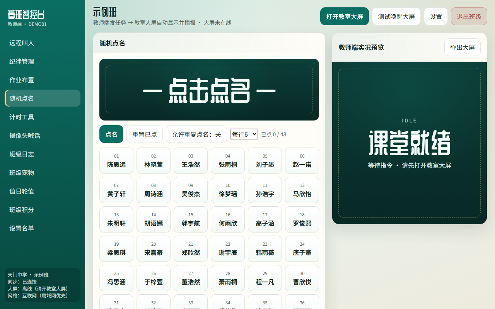

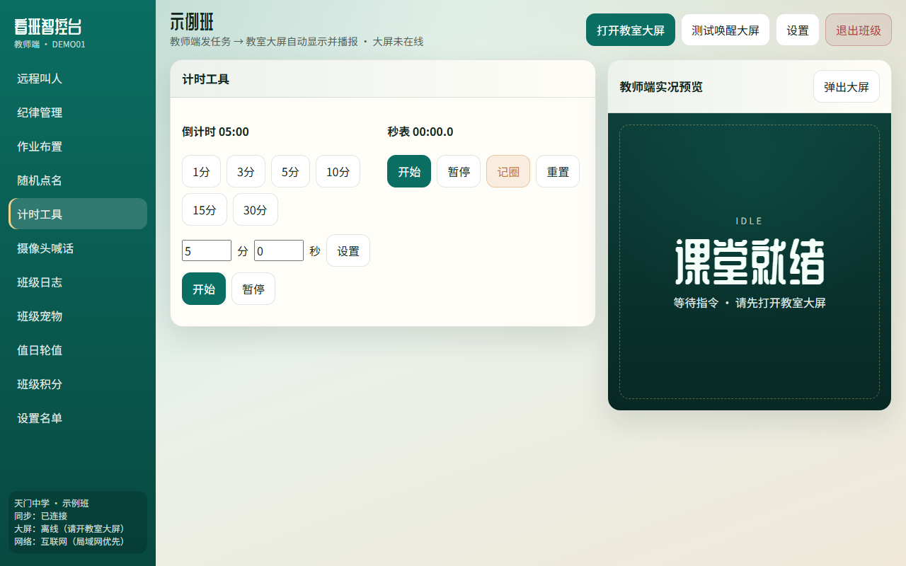

管理后台另有入口，可看各班概况（管理员账号另设）。对普通任课老师，日常就教师端这十一二个按钮够用。

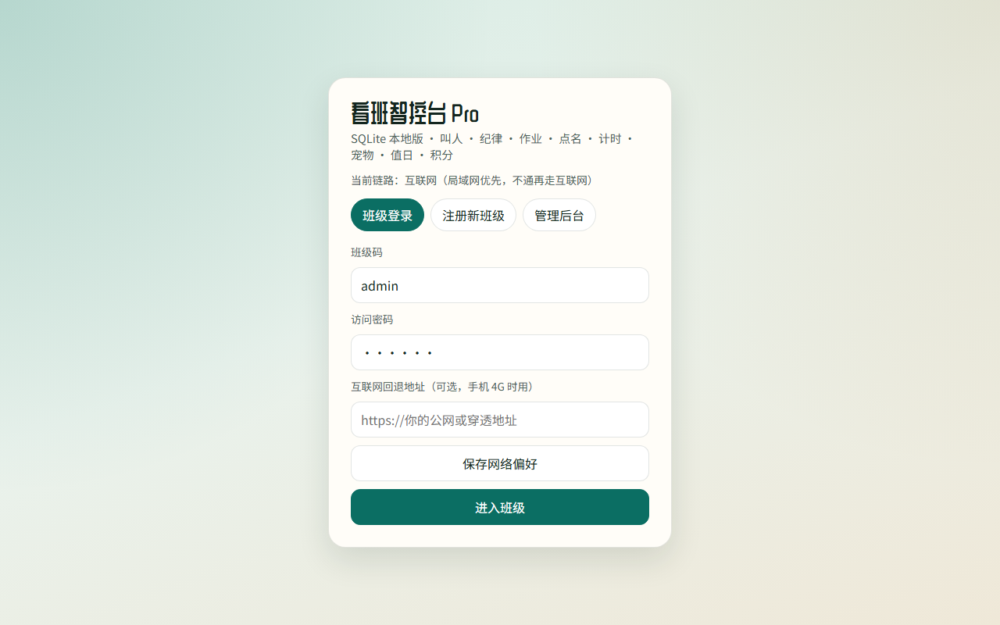

---

## 四、你现在就可以试的最短路径

1. 打开 http://test.zjjdg.top:5666/  
2. 班级 `DEMO01`，密码 `123456`  
3. 一浏览器进教师端，另一标签用大屏模式打开（或点「打开教室大屏」）  
4. 先点「远程叫人」喊一个示例学生  
5. 再进「摄像头喊话」看状态区字段（演示环境摄像头视机器而定）

WorkBuddy 手搓的好处不是“一夜写出完美产品”，而是：**你能按真实课堂把叫人话术、播报队列、摄像头权限这些恶心细节一轮轮补上**。远程叫人和摄像头喊话，恰恰是补丁打得最多的两块——也是我愿意单独开一篇写的原因。

上一篇：通用提示词怎么把整系统迭代出来。  
这篇：办公室里，怎么把人喊到、把班看住。

去点两下试试。不好用的地方，欢迎直接怼——这种系统，本来就该在骂声里变好用。
