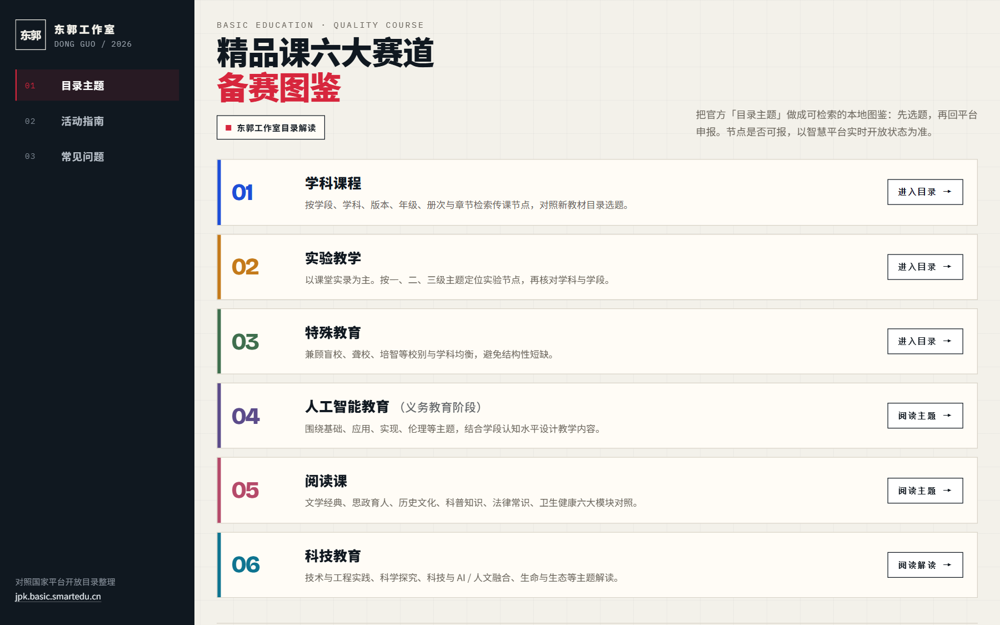
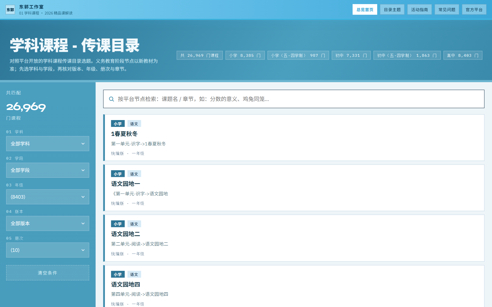
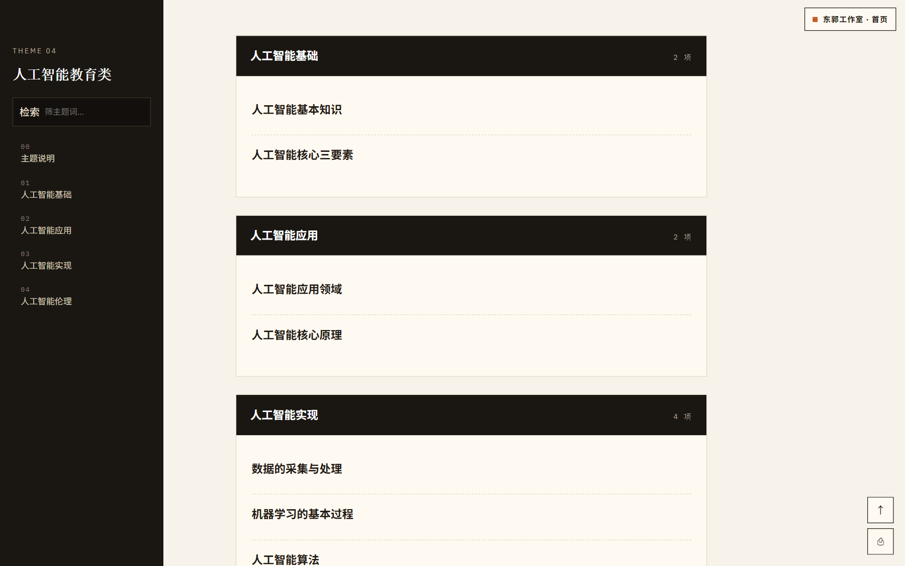
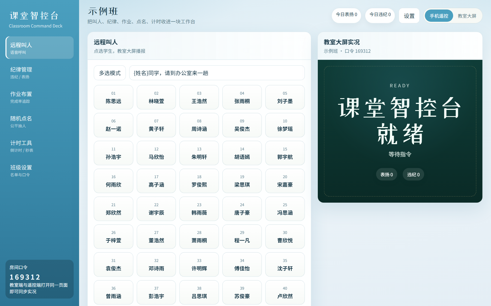
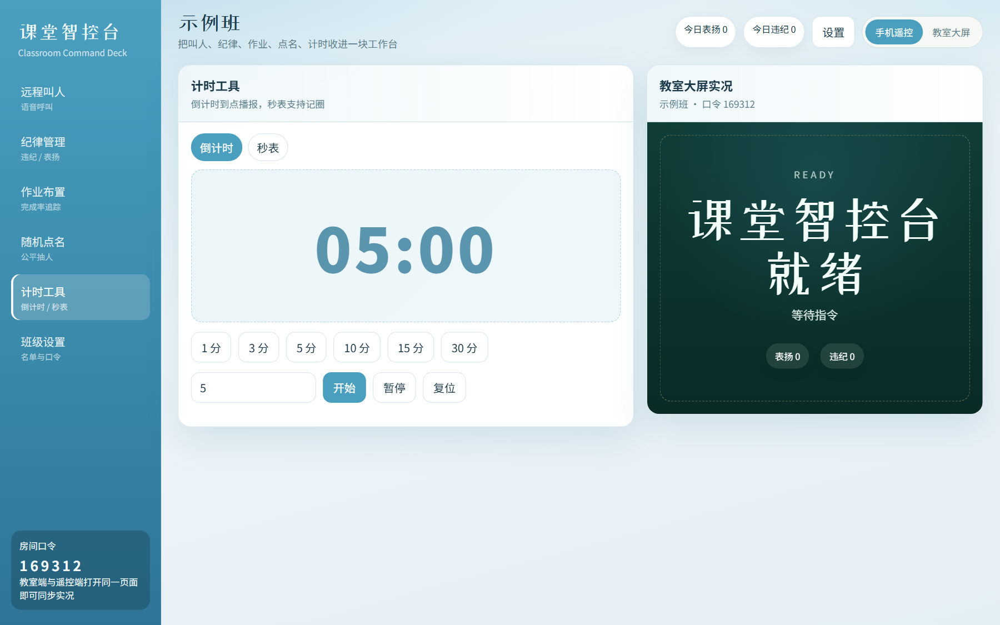

# 别再把官方平台当文件夹翻了：我给老师做了两套「真能上手」的网页

上周有个老师跟我说，打开精品课平台像进了大型商场——入口挺多，就是不知道先往哪走。另一位则天天把课堂计时器、随机点名、PPT 切来切去，课间恨不得多长两只手。

这两种烦，我都碰到过。于是自己动手，做了两套本地网页：一套帮你把 **2026 精品课解读** 理成可逛的目录；一套把 **课堂常用工具** 收进同一扇门。配色也统一成了秋波蓝，看着不累。

这篇文章不讲概念，只讲我怎么用、你怎么抄作业。

---

## 先说结论

> [!important] 一句话
> 官方平台负责「申报与开放节点」；本地页负责「找得快、讲得清、课上少切屏」。两套东西，别混着用。

申报、时间节点、平台规则——还是以 [国家中小学智慧教育平台精品课](https://jpk.basic.smartedu.cn/) 实时开放为准。我做的是解读导航和课堂工具，不是替代官方入口。

---

## 第一扇门：精品课解读首页

以前几个 HTML 散落在文件夹里，双击哪个文件、版本写在哪儿、LOGO 还挂着旧名字……用起来像在考古。

现在打开首页，左边三条线：**目录主题 / 活动指南 / 常见问题**。右边六条通道，对应学科目录、实验、特教，以及 AI、阅读、科技主题解读。点进去就走，不用猜文件名。

*东郭工作室 · 2026精品课解读门户*

我改界面时把旧水印和版本号都清了，品牌统一成「东郭工作室」。颜色也从那种「深夜工作室黑」换成了中等秋波蓝——教室投影和大屏上，蓝底白字更稳。

---

## 选课目录：搜索 + 左侧筛选，不再死磕表格

学科精品课目录页，我没再做「大表格往下滚」。上面搜索，左边筛，中间卡片流。你要找某一年级、某一学科，几下就能缩范围。

*搜索、筛选、卡片流：对照平台开放节点自己核对*

实验教学、特殊教育两套目录，交互同一套逻辑。省得老师记三套操作习惯。

主题内容页（比如人工智能教育类）则是左侧目录 + 右侧阅读区，适合边对照官方说明边备课。

*主题页：侧栏目录跟着走，长文不迷路*

> [!tip] 实用提醒
> 材料标注了 2026，但申报节点以平台当下开放为准。本地页帮你「找内容、对主题」，不替你「卡截止日」。

---

## 第二扇门：课堂工具站 classroom-hub

精品课是「备赛 / 选题」那条线。课上另一件事更碎：计时、随机、板书辅助、各种小工具……每个开一个网页或软件，切屏就打断节奏。

所以我把课堂常用能力收进 **classroom-hub**。同样是秋波蓝侧栏，一眼能认出是同一套东西。

*classroom-hub：课堂工具收在同一扇门里*

切到计时等面板时，布局还是那一套蓝——老师不用重新学「这是哪个产品」。

*侧栏切换面板，少切应用、少丢节奏*

我自己上课会把工具站投到副屏或浏览器标签里固定住。主屏继续 PPT，副屏负责「点人、倒计时」。比五个书签来回跳踏实。

---

## 我为什么要统一成「秋波蓝」

不是为了好看。

同一套色，老师记品牌；投影上对比够；深海蓝太闷、高亮青蓝又刺眼，中等秋波蓝折中。精品课解读和 classroom-hub 共享同一视觉语言，以后再加页也不显得拼凑。

---

## 你可以怎么用

1. **备精品课 / 对主题**：先开解读首页 → 目录或主题 → 再回官方平台核节点。
2. **日常上课**：classroom-hub 常驻一个标签，计时和点名少切屏。
3. **分享给同事**：两套都是本地网页，拷文件夹就能用；别指望它替代智慧教育平台登录申报。

> [!warning] 边界说清楚
> 本地页不采集账号、不代替官方提交。有争议的以教育部平台与当期通知为准。

---

## 写在最后

老师缺的往往不是「再多一个 AI 名词」，而是少翻几次文件夹、少切几次窗口。

这两套页，就是奔着这件事做的。你要是也在备精品课，或者课上被小工具弄得手忙脚乱——拿去用，改成你校自己的入口也行。

有问题直接留言。东郭工作室，继续改。
